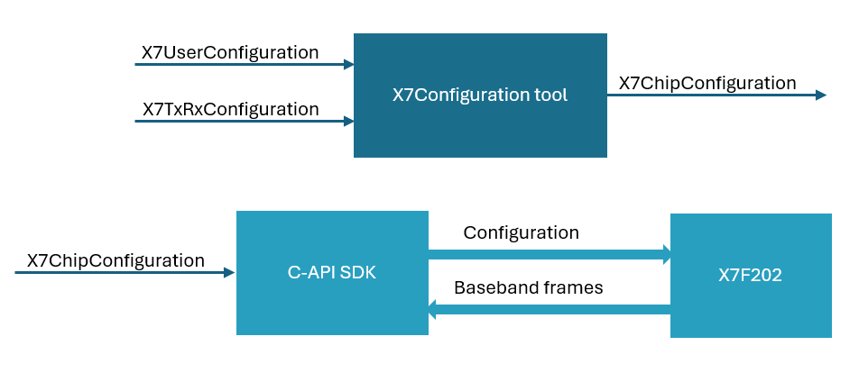

# SDK Documentation - Getting started

This release folder contains two different packages, the SDK and a
configuration tool. The configuration tool is called X7Configuration to
generate chip configurations that can later be used in the RadarDirect example
in the SDK package.

The typical flow of using the configuration tool and the SDK is to first use
the configuration tool to generate the chip configuration based on the desired
user and TxRx configurations. These chip configurations can later be used with
the SDK to configure the X7F202 chip and read out baseband frames.



The X7F202 requires a host controller to store the sensor FW and upload FW and
initialize the sensor during boot. The SDK has support for both a
RasberryPi4 and an ARM-Cortex-M4 host. There are two examples included in the
SDK; RadarDirect and ULPP Presence 2D. RadarDirect gives users low-level
access to setting up the radar and reading out raw signal for developing their
own algorithms. ULPP is a complete sensor solution, that delivers a
presence/no-presence output based on a set of high-level settings. For more
information about the examples and build instructions, refer to
example/*/README.md and example/*/*_product_description.md.

## X7Configuration tool for RadarDirect

As previously mentioned, the flow is to use the X7Configuration tool first to
get the chip configuration that corresponds with the desired configurations.
Follow the setup list below to get started with the tool. Please note that this
tool only works for RadarDirect, not ULPP.

Requirements:

| Tool       | Version|
|:-----------|:-------|
| Python     | 3.10   |
| VSCode     |        |

### Setup

#### Option 1: Using VSCode

1. Verify that you have the correct python installation by running
   ```python --version```. If you do not get v3.10 please install the correct
   version before moving on to the next step.

2. Optional: Create a virtual environment to avoid interfering with your global
   python environment. It is not mandatory but recommended. Create the
   environment by running ```python -m venv .env``` and activate the
   environment run:

    On Windows:
    ```
    .env\Scripts\activate
    ```
    On Unix or MacOS:
    ```bash
    source .env/bin/activate
    ```

3.  Install the pyx7configuration package:
    ```python -m pip install pyx7configuration/pyx7configuration-1.0.x-cp310-*.whl```.

4. In VSCode, open pyx7configuration/pyx7configuration.ipynb. You
   have now opened the notebook and have access to the documentation.

5. To be able to run the code snippets in the notebook, you have to configure
   which kernel to use. In the top right corner of the notebook, click on
   "Configure Kernel". If you are using a virtual environment you might need to
   add the path manually by following these steps:

    5.1. Ctrl + Shift + P

    5.2. Add path to .env

    5.3. Select as kernel

You are now ready to start experiment with settings in the different examples!
When you are done, you can take your configuration parameters to an example
and start using them.

Note that the first time you run the code it might prompt you to install
ipykernel to make it work.

#### Option 2: Using jupyter

1. Verify that you have the correct python installation by running
   ```python --version```. If you do not get v3.10 please install the correct
   version before moving on to the next step.

2. Optional: Create a virtual environment to avoid interfering with your global
   python environment. It is not mandatory but recommended. Create the
   environment by running ```python -m venv .env``` and activate the
   environment run:

    On Windows:
    ```
    .env\Scripts\activate
    ```
    On Unix or MacOS:
    ```bash
    source .env/bin/activate
    ```

3.  Install the pyx7configuration package:
    ```python -m pip install pyx7configuration/pyx7configuration-1.0.x-cp310-*.whl```.

4. Install jupyter ```python -m pip install jupyter```

5. Open the notebook ```jupyter-notebook pyx7configuration/pyx7configuration.ipynb```

You are now ready to start experiment with settings in the different examples!
When you are done, you can take your configuration parameters to an example
and start using them.
